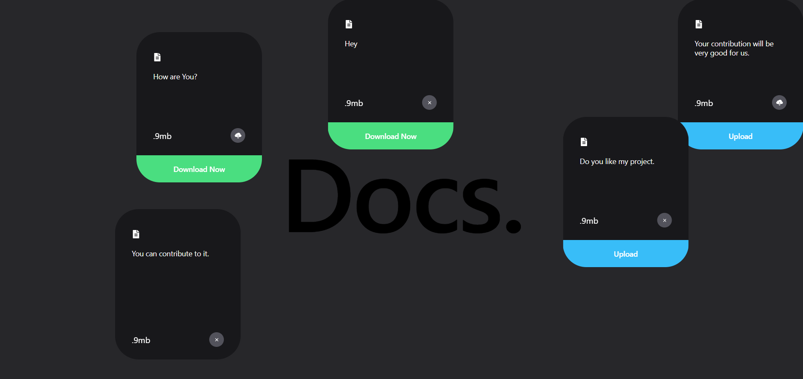

# Docs

A React Application in which we can create our docs or notes. This is an practice application.

## Technologies Used

### 1 -> Tailwind CSS

### 2 -> React

## Application Running steps

1. Open Application in the code editor.
2. Install Node js if not installed from [Node Js](https://nodejs.org/en/download)
3. Run the command `npm install` in the terminal.
4. Now run `npm run dev`

And now you are ready to go, your application is now live.

## Your Contribution Is Very Precious to Us.

